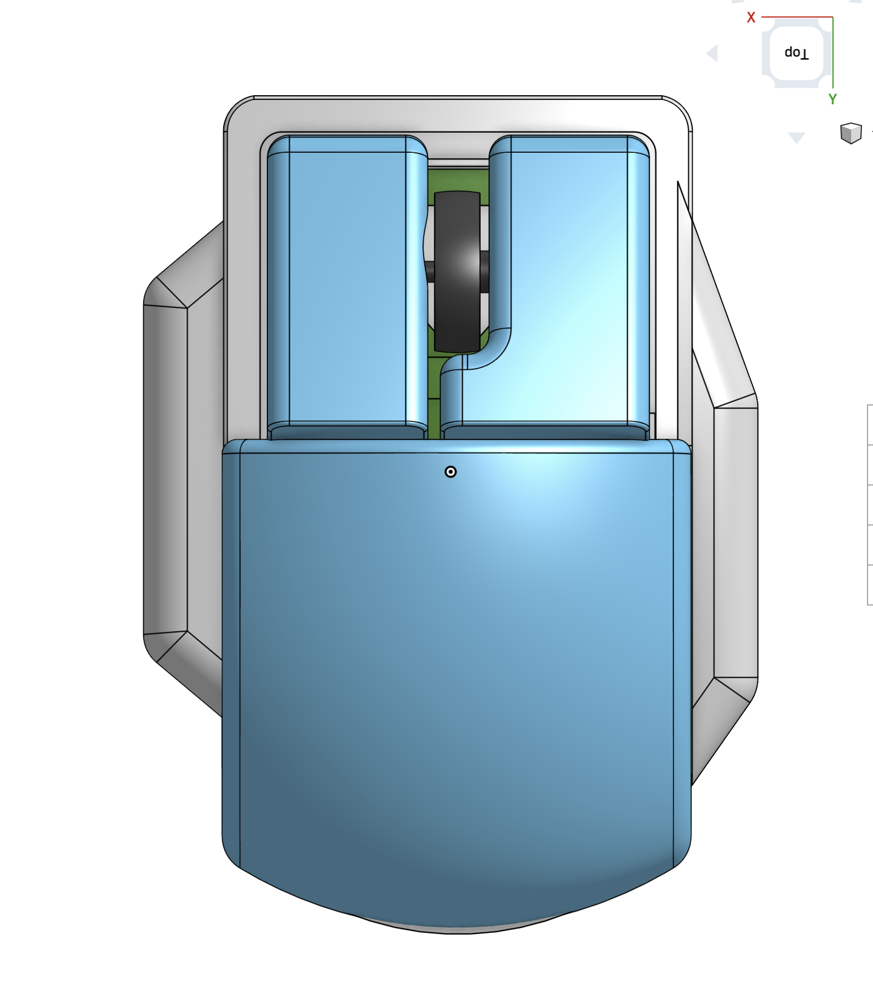

# Clickster: the mouse
A ergonomic mouse made for the Bambu Lab Mouse Kit. Design inspired by Logitech MX Master Mouse.

## Links
Link to OnShape document: [https://cad.onshape.com/documents/141c320fbbb33a39dca4d922/w/803c7ef3e32e289fe1ae76c9/e/0fad27d7a071263d530458c0?renderMode=0&uiState=687537f89a278a3e3286551d](https://cad.onshape.com/documents/141c320fbbb33a39dca4d922/w/803c7ef3e32e289fe1ae76c9/e/0fad27d7a071263d530458c0?renderMode=0&uiState=687537f89a278a3e3286551d)

*P.S I know that the base cover is intersecting the base plate. this is so that the base cover can be printed vertically without much supports. (shoutout to reddit community for that improvement idea)

## Images

